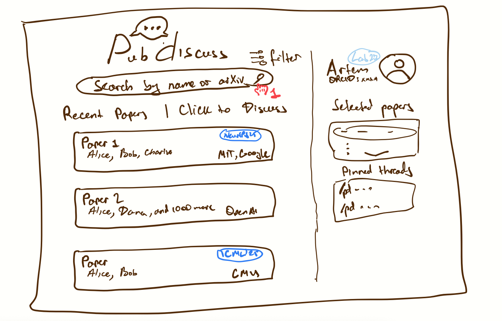
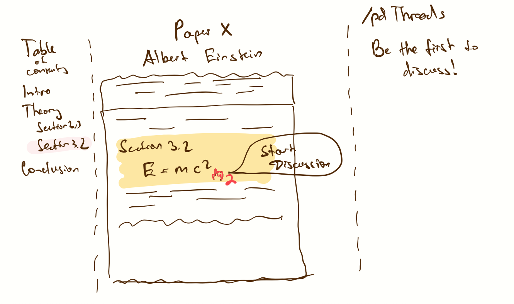
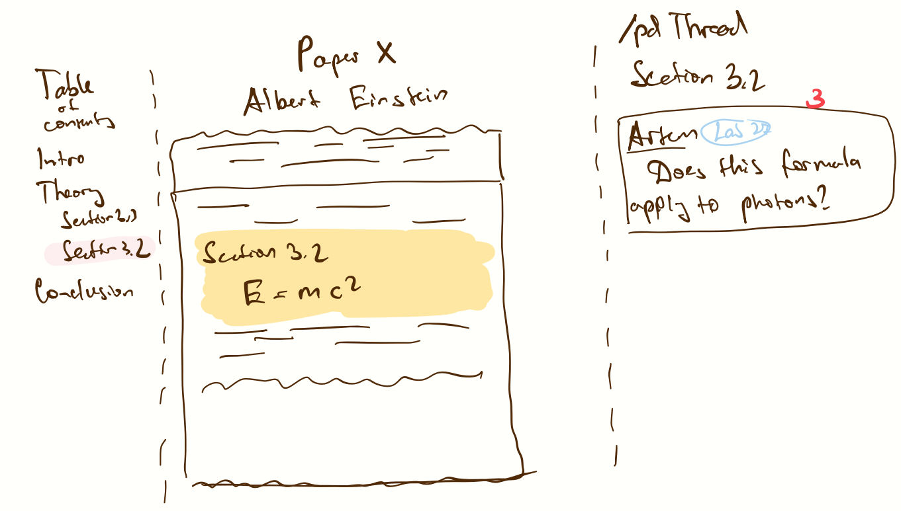
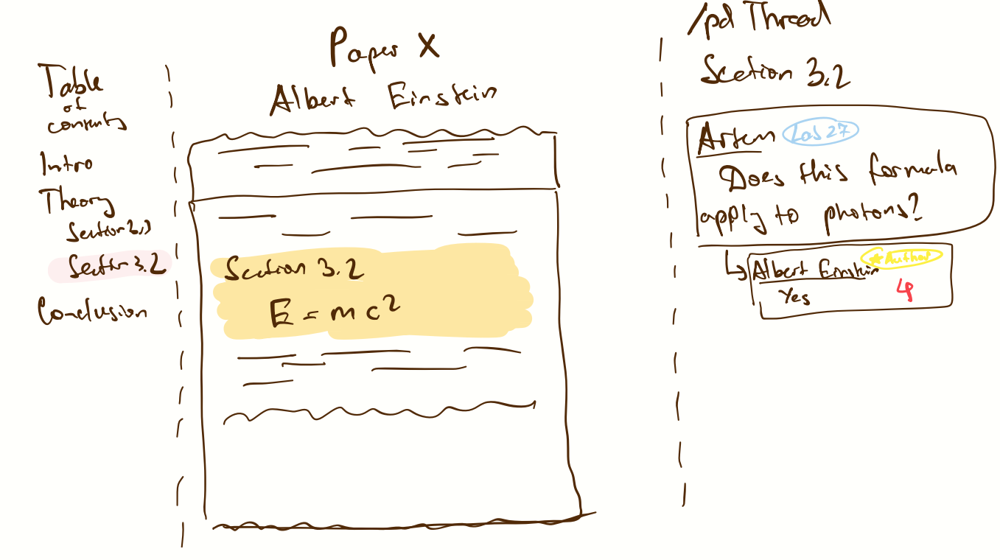
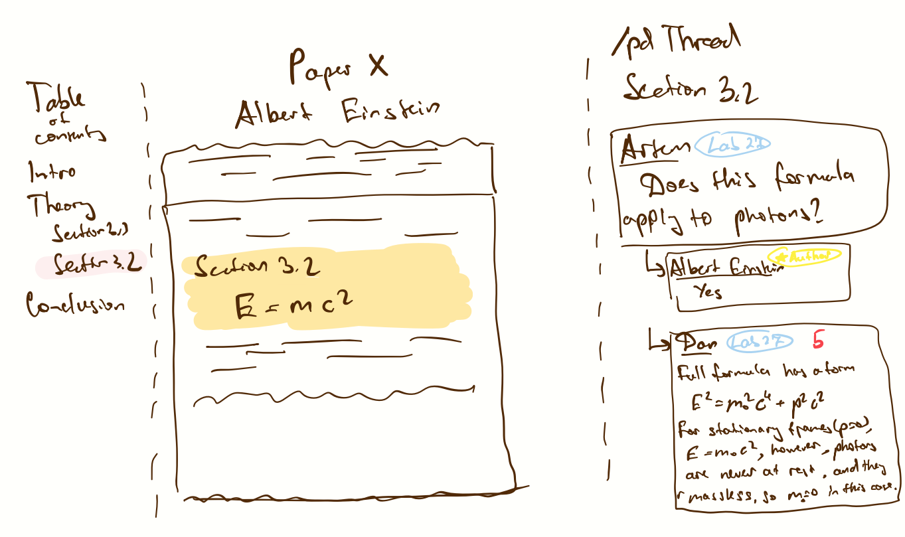

# Assignment 2: Functional Design

## Project: Paper Discussion Platform

> Goal: expand the 'paper discussion' problem from Assignment 1 into a focused, minimal app that is real, not a proof of concept.

---

## 1) Problem Statement

### Domain

**Academic research communication & collaboration.**
I follow research communities where discourse around new papers is fragmented across Slack threads, hard-to-accepted-in conferences, X/Twitter, YouTube comments, and other forums. I care about making this engagement more liquid: easier to find, join, and reference, so that feedback, error‑finding, and idea exchange happen earlier and more often.

### Problem

**Fragmented, low‑signal discussion for specific papers.**
For any given paper, relevant discussion is scattered and hard to locate. Lab‑intreernal thads are invisible to outsiders; social media is hype‑driven and ephemeral; YouTube comments are diffuse and not anchored to precise parts of the paper, top-tier conferences have a small capacity of papers they can accept. This raises the cost of asking good questions, surfacing corrections, and building on others' insights.

### Stakeholders

* **Authors (researchers)** — benefit from targeted feedback, errata discovery, new suggestions, and clarifications tied to specific passages/figures.
* **Engaged readers (students/early‑career researchers)** — need a place to ask scoped questions and see authoritative answers.
* **General technical audience** — can contribute applied perspectives; currently excluded by lab silos.
* **Moderators/maintainers** — keep discourse high‑signal and civil with light‑weight tools.

### Evidence & Comparables 

1. **PubPeer** — niche adoption for post‑publication review; demonstrates value of per‑paper threads but lacks broad, anchored discussion.
2. **ResearchGate Q&A** — general forum with mixed engagement quality; signals demand for discussion features.
3. **X/Twitter paper threads** — high reach but low structure; discovery decays quickly; limited depth.
4. **alphaXiv/summary tools** — interest in better paper discovery & summaries; adjacent but not a discussion venue.
5. **Lab Slack 'paper‑dump' channels** — common, but private and ad‑hoc; threads are not discoverable by field.
6. **YouTube explainer comments** — activity exists but comments are detached from paper sections/figures and spread across duplicate videos.

*(Evidence uses the sources listed in [Assignment 1](assignment_1.md); I keep them here as comparables and observed behavior.)*

---

## 2) Application Pitch 

**Name**: **PubDiscuss** (per‑paper '**pub**' for anchored **discussion**)

**Motivation**: Finding and joining serious discussion for *this* paper is hard; PubDiscuss creates a canonical, anchored discussion space keyed by DOI/arXiv where authors and readers meet.

**Key features**

1. **Discussion Pubs (per DOI/arXiv)** — Every paper gets a canonical home. Why it helps: eliminates fragmentation; one link to share. Impact: authors and readers converge; moderators have one venue to maintain.
2. **Inline Anchors & Highlighted Threads** — Comments attach to a section/figure/line range. Why it helps: precise context, less talking past each other, easier error‑finding. Impact: authors resolve specific misconceptions; readers learn faster.
3. **Verified Identity Badges (ORCID/affiliation)** — Optional ORCID or institutional email yields badges (Author, Affiliation). Why it helps: establishes trust without doxxing. Impact: readers can triage expert replies; authors gain visibility.

---

## 3) Concept Design 

We use 4 concepts plus representative syncs. Generic parameters appear in brackets.

### 3.1 Concept Specifications

**concept** PaperIndex [PaperId]  
**purpose** maintain the set of known papers and their identifiers (DOI, arXiv)  
**principle** if a paper is referenced by id, it can be looked up and linked by other concepts  
**state**  
&nbsp;a set of Papers with  
&nbsp;&nbsp;id: PaperId  
&nbsp;&nbsp;title: String  
&nbsp;&nbsp;authors: Set<User>  
&nbsp;&nbsp;externalLinks: Set<URL>  
**actions**  
&nbsp;ensure (id: PaperId, title?: String, authors?: Set<User>, links?: Set<URL>): (paper: Paper)  
&nbsp;&nbsp;**requires** none  
&nbsp;&nbsp;**effects** if paper(id) exists return it; else create minimal record and return

---

**concept** DiscussionPub [PaperId, User]  
**purpose** provide a canonical discussion space per paper  
**principle** each paper has at most one pub; threads belong to exactly one pub  
**state**  
&nbsp;a set of Pubs with  
&nbsp;&nbsp;paperId: PaperId  
&nbsp;&nbsp;threads: Set<Thread>  
&nbsp;a set of Threads with  
&nbsp;&nbsp;pub: Pub  
&nbsp;&nbsp;anchor: AnchorRef?  
&nbsp;&nbsp;author: User  
&nbsp;&nbsp;createdAt: Time  
&nbsp;&nbsp;body: RichText  
&nbsp;&nbsp;replies: Set<Reply>  
&nbsp;a set of Replies with  
&nbsp;&nbsp;thread: Thread  
&nbsp;&nbsp;author: User  
&nbsp;&nbsp;createdAt: Time  
&nbsp;&nbsp;body: RichText  
**actions**  
&nbsp;open (paperId: PaperId): (pub: Pub)  
&nbsp;&nbsp;**requires** no pub exists for paperId  
&nbsp;&nbsp;**effects** create pub  
&nbsp;startThread (pub: Pub, author: User, body: RichText, anchor?: AnchorRef): (thread: Thread)  
&nbsp;&nbsp;**requires** pub exists  
&nbsp;&nbsp;**effects** create thread with optional anchor  
&nbsp;reply (thread: Thread, author: User, body: RichText): (reply: Reply)  
&nbsp;&nbsp;**requires** thread exists  
&nbsp;&nbsp;**effects** create reply

---

**concept** AnchoredContext [PaperId]  
**purpose** model precise anchors inside a paper (sections, figures, line ranges)  
**principle** anchors refer to locations in a paper without needing the paper's content here  
**state**  
&nbsp;a set of Anchors with  
&nbsp;&nbsp;paperId: PaperId  
&nbsp;&nbsp;kind: {Section|Figure|Lines}  
&nbsp;&nbsp;ref: String  
&nbsp;&nbsp;snippet: String  
**actions**  
&nbsp;create (paperId: PaperId, kind, ref, snippet): (anchor: AnchorRef)  
&nbsp;&nbsp;**requires** paper exists in PaperIndex  
&nbsp;&nbsp;**effects** create anchor

---

**concept** IdentityVerification [User]  
**purpose** attach optional trust signals (ORCID/affiliation) to users  
**principle** a user can verify claims out‑of‑band; verified badges appear next to their posts  
**state**  
&nbsp;a set of Verifications with  
&nbsp;&nbsp;user: User  
&nbsp;&nbsp;orcid: String?  
&nbsp;&nbsp;affiliation: String?  
&nbsp;&nbsp;badges: Set<Badge>  
**actions**  
&nbsp;addORCID (user: User, orcid: String)  
&nbsp;&nbsp;**requires** user exists, token validated externally  
&nbsp;&nbsp;**effects** set orcid; add badge 'ORCID'  
&nbsp;addAffiliation (user: User, domain: EmailDomain)  
&nbsp;&nbsp;**requires** proof of control for domain  
&nbsp;&nbsp;**effects** set affiliation; add badge 'Affiliation'  
&nbsp;badgeForAuthor (user: User, paperId: PaperId)  
&nbsp;&nbsp;**requires** user ∈ PaperIndex.Papers[paperId].authors  
&nbsp;&nbsp;**effects** add badge 'Author'

---

### 3.2 Essential Synchronizations

**sync** ensurePub  
**when** PaperIndex.ensure (id): (paper)  
**then** DiscussionPub.open (paperId: id)

**sync** anchorThread  
**when**  
&nbsp;AnchoredContext.create (paperId, kind, ref, snippet): (anchor)  
&nbsp;Request.startAnchoredThread (paperId, author, body)  
**then**  
&nbsp;DiscussionPub.startThread (pub: DiscussionPub.of(paperId), author, body, anchor)

**sync** authorBadge  
**when** DiscussionPub.startThread (pub, author, body): (thread)  
**where** author $\in$ PaperIndex.Papers[pub.paperId].authors  
**then** IdentityVerification.badgeForAuthor (author, pub.paperId)

**sync** mentionNotify  
**when**  
&nbsp;DiscussionPub.reply (thread, author, body): (reply)  
&nbsp;Text.extractMentions (body): (mentioned: Set<User>)  
**then** Notification.enqueue (to: mentioned, about: reply)

---

### 3.3 Concept Roles Note 

* **PaperIndex** is the registry of paper ids and metadata. Other concepts never assume more than the id/title/authors; content lives elsewhere (PDF hosting is out of scope).
* **DiscussionPub** is the user‑facing forum per paper. It does not parse PDFs; it only links to anchors via **AnchoredContext**.
* **AnchoredContext** provides locations (section/figure/lines) plus a small, human‑readable snippet. This keeps concepts independent of PDF storage.
* **IdentityVerification** is optional but adds trust signals. It never exposes private data; it records only proof‑of‑verification and badges. Badges are generic strings so other roles (e.g., 'Moderator') can be added later without changing other concepts.

Generic instantiations: `PaperId := DOI|arXivId`; `User := platform account`. Anchor targets are always `PaperId`, not Threads, preserving independence.

I was thinking about an upvoting system and a personal library where users can save notes and bookmarked discussions, but these are future extensions and not part of the current design.

---

## 4) UI Sketches

### Sketch 1: Home / Discover

### Sketch 2: Paper Discussion

### Sketch 3: Create Inline Anchor

### Sketch 4: Author Reply

### Sketch 5: Peer Reply

---

## 5) User Journey 

**Persona**: Artem, a twelveth‑year PhD student in ML. On Slack, his advisor asks him to check a new paper. Artem sees this arXiv paper shared on X/Twitter with little to no discussions, and wants to understand Section 3.2 better.

1. **Trigger** — Artem goes to PubDiscuss and clicks on 'Discuss this paper on PubDiscuss', landing on the paper's pub ([Sketch 1](#sketch-1-home--discover)). He follows the paper.
2. **Anchor & Ask** — He selects lines in Section 3.2 and opens 'New Anchor' ([Sketch 2](#sketch-2-paper-discussion)). PubDiscuss captures a snippet and opens a thread pre‑filled with the anchor. He posts a question ([Sketch 3](#sketch-3-create-inline-anchor)).
3. **Author/User Response** — The first author (badge 'Author' + ORCID) replies in the anchored thread clarifying an assumption and correcting a typo ([Sketch 4](#sketch-4-author-reply)). The badge helps Artem trust the answer.
4. **Learn More** — A verified lab mate adds a short derivation as a reply, anchored to the same section ([Sketch 5](#sketch-5-peer-reply)). The thread accumulates precise, reusable context.
5. **Feedback loop** – Artem reads author's reply and comes up with a follow up question. However, this question has been answered by his lab mate ([Sketch 5](#sketch-5-peer-reply)), so Artem is happy, and understands Section 3.2 now.
6. **Outcome** — When others arrive later (from Slack or X), they can jump to the anchored thread and avoid repeating the same question. The canonical pub consolidates discussion and elevates the best explanations.

---

## Scope & Real‑App Constraints

* **Minimal viable concepts**: PaperIndex, DiscussionPub, AnchoredContext, IdentityVerification. PDF storage, full‑text search, moderation, and recommendation systems are out of scope for now.
* **Friction reduction**: Sign‑in with verified domain (like `.edu` or `openai.com`, or `google.com`, or `anthropic.com`, etc) email; optional ORCID verification for badges. Starting a thread requires only pasting a DOI/arXiv id; the pub is auto‑created via `ensurePub`.
* **No network effects required**: Per‑PubDiscusss are useful even with a few posts; authors can link their paper’s pub from arXiv or personal sites. The app is already useful at a lab scale (~10 people).

## Risks & Mitigations

* **Anchor drift** — Store anchors as stable identifiers (section labels/figure numbers) plus human snippet; avoid brittle PDF byte offsets.
* **Low adoption** — Make it really easy to adopt by ensuring every paper has a simple, permanent URL, and by minimizing friction for avg user. In other words,  solved by ease of sharing and great usability (hard to implement).
* **Spam/low signal** — Light‑weight moderation role (badge), verification, and mention‑based notifications only.
